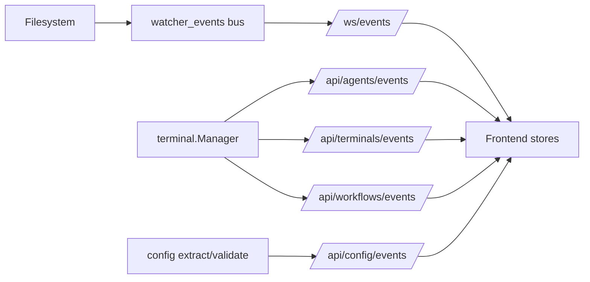
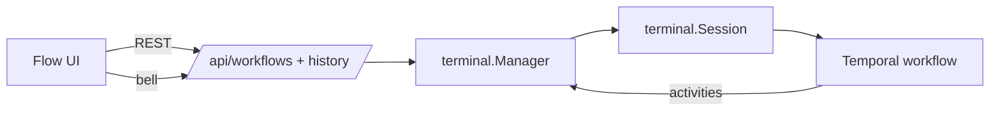

<h1 align="center">
  Gestalt<br/><br/>
  <sub>We invite you to stop assembling the pieces and start perceiving the whole.</sub>
</h1>

<p align="center">
  <a href="https://dyne.org">
    
  </a>
</p>

<br><br>

### 📖 More info on [dyne.org/gestalt](https://dyne.org/gestalt) <!-- omit in toc -->

***

<div id="toc">

### 🚩 Table of Contents  <!-- omit in toc -->

- [🎮 Quick start](#-quick-start)
- [💾 Build](#-build)
- [🏗️ Development (Vite)](#️-development-vite)
- [Run Gestalt on your project](#run-gestalt-on-your-project)
- [Event-driven architecture](#event-driven-architecture)
- [Temporal (dev server)](#temporal-dev-server)
- [Temporal workflows (HITL)](#temporal-workflows-hitl)
- [Notify notary (gestalt-notify)](#notify-notary-gestalt-notify)
- [Future handoff design (deferred)](#future-handoff-design-deferred)
- [🧪 Testing](#-testing)
- [📌 Versioning](#-versioning)
- [📟 Command-Line Interface](#-command-line-interface)
- [⚙️ Configuration](#️-configuration)
- [Dashboard](#dashboard)
- [🫵 Touch scrolling](#-touch-scrolling)
- [📦 Embedded Resources](#-embedded-resources)
- [⬆️ Upgrading Gestalt](#️-upgrading-gestalt)
- [🐛 Troubleshooting config extraction](#-troubleshooting-config-extraction)
- [📂 Filesystem watching](#-filesystem-watching)
- [Filesystem Event System](#filesystem-event-system)
- [🐝 API endpoints](#-api-endpoints)
- [🔔 Logging and notifications](#-logging-and-notifications)
- [Agent profiles](#agent-profiles)
- [Agent Skills](#agent-skills)
- [CLI](#cli)
- [💼 License](#-license)

</div>

***
## 🎮 Quick start

Install temporal-cli on your machine following the [temporal setup steps](https://temporal.io/setup/install-temporal-cli).

Install all gestalt cli tools directly from the github releases:
```sh
# available os: linux, darwin, windows
# available arch: amd64, arm64
wget https://github.com/dyne/gestalt/releases/latest/download/gestalt-linux-amd64.tar.gz
sudo tar -xzf gestalt-linux-amd64.tar.gz -C /usr/local/bin

# move into your project
cd your/project

# start gestalt
gestalt
```

**[🔝 back to top](#toc)**
***

## 💾 Build

Make sure to have installed:
* node@24.13.0
* go@1.25.5
* npm@11.8.0

You can install them by hand or use [mise](https://mise.jdx.dev/) and run `mise install` in the root of the repository.

Now you can build running:
```
npm i
make
make install
```

Now you can run gestalt with in any repository:
```
gestalt
```

Default frontend listens on 0.0.0.0:57417; the backend binds to a random free port unless `GESTALT_BACKEND_PORT` is set.

When running local open browser at http://localhost:57417

**[🔝 back to top](#toc)**
***

## 🏗️ Development (Vite)

`make dev` starts the backend plus Vite. The Vite dev server proxies `/api` and `/ws`
to `GESTALT_BACKEND_URL` (default `http://localhost:57417`).

Run multiple isolated instances by choosing unique backend URLs:
```
GESTALT_BACKEND_URL=http://localhost:9101 make dev
GESTALT_BACKEND_URL=http://localhost:9102 make dev
```

If you set `GESTALT_BACKEND_URL`, it should point at the backend API port. `GESTALT_PORT`
controls the UI bind port for `gestalt`.

**[🔝 back to top](#toc)**
***

## Run Gestalt on your project

Gestalt uses its current working directory as the project context (for git events, `.gestalt/plans/`, and
local session data). To use it on a real repo, run the server from that repo's root.

1) Install the `gestalt*` binaries, as we did in [build](#-build) or [quick-start](#-quick-start) chapters.

2) Gestalt automatically extracts a per-project config bundle to `.gestalt/config/` on startup.
   (No need to run `--extract-config`.)

3) Edit agent profiles in `.gestalt/config/agents/*.json`.

Quick tips:
- The agent ID is the filename (without `.json`).
- `shell` is the interactive command Gestalt runs (it must accept typed stdin as chat input).
- `prompt` entries reference `.gestalt/config/prompts/<name>.txt`.

Example mapping:
- Coder: `copilot --allow-all-tools --disable-builtin-mcps`
- Architect: `gemini`
- Fixer: `amp`

4) Start Gestalt from the same project root and open the UI:
```
GESTALT_TOKEN=$(openssl rand -hex 16) gestalt --port 57417
```

Plans live under `.gestalt/plans/` and any `.org` file in that directory is watched for changes.
Recommended naming: `YYYY-MM-DD-short-description.org`. `.gestalt/PLAN.org` is no longer used.

### Authentication (GESTALT_TOKEN) <!-- omit in toc -->

`GESTALT_TOKEN` is an optional shared secret that protects the Gestalt HTTP API.

- If you don't set `GESTALT_TOKEN`, auth is disabled.
- If you set `GESTALT_TOKEN`, every REST and WebSocket request must present the same token.

Auth mechanics:
- REST: `Authorization: Bearer <token>`
- WebSocket: `?token=<token>`

Because the default bind is `0.0.0.0:57417`, setting a token is strongly recommended whenever the
server is reachable from other machines on your network.

Generate a token:
- macOS/Linux: `export GESTALT_TOKEN=$(openssl rand -hex 16)`
- Windows PowerShell `$env:GESTALT_TOKEN = -join ((48..57)+(97..102) | Get-Random -Count 32 | % {[char]$_})`

**[🔝 back to top](#toc)**
***

## Event-driven architecture

Gestalt uses typed event buses to decouple backend state changes from UI updates. WebSocket streams expose
filesystem, agent, terminal, config, and workflow events for realtime dashboards.

Key event streams:
- `/ws/events` (filesystem)
- `/api/agents/events`
- `/api/terminals/events`
- `/api/config/events`
- `/api/workflows/events`

Debugging:
- `GESTALT_EVENT_DEBUG=true` logs all published events.

Event flow:


**[🔝 back to top](#toc)**
***

## Temporal (dev server)

Gestalt's HITL workflow integration uses the Temporal CLI (`temporalio/cli`) for local development.

Install the Temporal CLI:
- macOS: `brew install temporal`
- Other platforms: download a release from https://github.com/temporalio/cli/releases

Gestalt auto-starts the Temporal dev server by default and stores its data/logs under `.gestalt/temporal`.
Auto-start binds to `0.0.0.0` and picks random gRPC/UI ports unless you set `GESTALT_TEMPORAL_HOST`.
Disable auto-start with `--temporal-dev-server=false` or `GESTALT_TEMPORAL_DEV_SERVER=false`.

Start the local Temporal dev server (includes the UI at http://localhost:8233):
```
make temporal-dev
```

The dev server stores workflow state in a local SQLite file in the working directory so sessions persist across restarts.
Auto-started servers use `.gestalt/temporal` instead.

Timeouts and retries (defaults):
- Workflow execution/run timeout: 24h (task timeout: 10s)
- Activity timeouts: spawn 30s, output read 5s, default 10s (heartbeat 10s)
- Retry policy: exponential backoff, max 5 attempts

**[🔝 back to top](#toc)**
***

## Temporal workflows (HITL)

Gestalt models terminal sessions as Temporal workflows so HITL pauses and resumes survive restarts. Each session workflow
tracks the agent, task context, and bell events so operators can see what is running and when human input is needed.

Session mapping:
- Workflow ID: `session-<terminal-id>`
- Workflow state: agent name, current L1/L2, bell events, status (running/paused/stopped)
- Task updates: send `session.update_task` signals to record L1/L2 changes (UI integration is forthcoming)
- Bell pauses: terminal bells send `session.bell` signals that pause the workflow
- Resume actions: `session.resume` with `continue` or `abort` (handoff reserved for future work)

Key endpoints:
- `GET /api/workflows`: list workflow summaries for the Flow tab
- `GET /api/terminals/:id/workflow/history`: workflow history (signals + events)
- `POST /api/terminals/:id/workflow/resume`: resume a paused workflow

Architecture:


Learn more: https://docs.temporal.io/

**[🔝 back to top](#toc)**
***

## Notify notary (gestalt-notify)

Gestalt records notify events as Temporal signals (`session.notify`) so workflow history is an auditable log.
Codex sessions inject a notifier hook automatically.

Try it:
1. Start Gestalt with Temporal enabled (default).
2. Start a Codex agent session and grab its session id (for example, `Coder 1`).
3. Send a manual notify event:
```
gestalt-notify --session-id '<session-id>' \
  '{"type":"plan-L1-wip","plan_file":".gestalt/plans/your-plan.org","heading":"Example","state":"wip","level":1}'
```
4. Send a progress event (Plan sidebar):
```
gestalt-notify --session-id 'Coder 1' \
  '{"type":"progress","plan_file":"plans-tab-sidebar.org","l1":"Show task bodies as raw org text","l2":"Extract heading bodies by slicing source text","task_state":"WIP","task_level":2}'
```
5. Query the latest progress state:
```
curl "http://localhost:57417/api/sessions/Coder%201/progress"
```
6. Verify the history includes a notify entry:
```
curl "http://localhost:57417/api/terminals/<session-id>/workflow/history"
```

**[🔝 back to top](#toc)**
***

## Future handoff design (deferred)

Handoff is planned for paused workflows so operators can delegate work to another agent without losing context.
The implementation is deferred; this is the proposed design only.

Design outline:
- `session.handoff` signal carries target agent id (optional), reason, and context snapshot.
- Manager selects a target agent when none is provided (round-robin or skill-based).
- A new session workflow starts for the target agent and records the parent workflow id.
- The original workflow marks itself as handed-off and stops accepting input.
- Context includes last output lines, current L1/L2, and recent task/bell history.
- Terminal control can be transferred or a new terminal spawned, based on agent availability.

**[🔝 back to top](#toc)**
***

## 🧪 Testing

Backend:
```
go test ./...
```

Frontend:
```
cd frontend
npm test
npm run test:coverage
```

**[🔝 back to top](#toc)**
***

## 📌 Versioning

Gestalt follows conventional commits and semantic versioning. Tags are the
source of truth and use the `vX.Y.Z` format.

Rules:
- `feat:` bumps minor (X.Y+1.Z)
- `fix:` bumps patch (X.Y.Z+1)
- `BREAKING CHANGE:` (or `!` in the header) bumps major (X+1.0.0)

Examples:
- `feat: add terminal history` → minor bump
- `fix: resolve connection bug` → patch bump

Automation:
- Push a conventional commit to `main` and GitHub Actions tags a release
  (e.g., `feat:` → `v1.1.0`).
- Initial release version is `v1.0.0`.

Build-time injection:
- Backend: `-ldflags "-X gestalt/internal/version.Version=$VERSION"`
- Frontend: Vite define uses the `VERSION` environment variable.

Local build with an explicit version:
```
make VERSION=1.2.3
```

**[🔝 back to top](#toc)**
***

## 📟 Command-Line Interface

CLI flags override environment variables, and environment variables override
defaults. Use `--help` to see the full flag list.

### gestalt <!-- omit in toc -->

Flags:
- `--port PORT` (env: GESTALT_PORT, default: 57417)
- `--backend-port PORT` (env: GESTALT_BACKEND_PORT, default: random)
- `--shell SHELL` (env: GESTALT_SHELL, default: system shell)
- `--token TOKEN` (env: GESTALT_TOKEN, default: none)
- `--session-persist` (env: GESTALT_SESSION_PERSIST, default: true)
- `--session-dir DIR` (env: GESTALT_SESSION_DIR, default: `.gestalt/sessions`)
- `--session-buffer-lines N` (env: GESTALT_SESSION_BUFFER_LINES, default: 1000)
- `--session-retention-days DAYS` (env: GESTALT_SESSION_RETENTION_DAYS, default: 7)
- `--input-history-persist` (env: GESTALT_INPUT_HISTORY_PERSIST, default: true)
- `--input-history-dir DIR` (env: GESTALT_INPUT_HISTORY_DIR, default: `.gestalt/input-history`)
- `--max-watches N` (env: GESTALT_MAX_WATCHES, default: 100)
- `--verbose` / `--quiet`
- `--help` / `--version`

Subcommands:
- `gestalt validate-skill PATH`
- `gestalt completion bash|zsh`

Examples:
- `gestalt --port 9090 --backend-port 9091 --token abc123`
- `gestalt --session-persist=false --input-history-persist=false`

### gestalt-send <!-- omit in toc -->

Flags:
- `--url URL` (env: GESTALT_URL, default: http://localhost:57417)
- `--token TOKEN` (env: GESTALT_TOKEN, default: none)
- `--start` (auto-start agent if not running)
- `--verbose` / `--debug`
- `--help` / `--version`

Examples:
- `cat file.txt | gestalt-send copilot`
- `gestalt-send --url http://remote:57417 --token abc123 agent-id`

**[🔝 back to top](#toc)**
***

## ⚙️ Configuration

Configuration can be provided via CLI flags or environment variables. CLI flags
override environment variables, and environment variables override defaults.
Run `gestalt --help` or `gestalt-send --help` for the full list. Environment
variables remain supported for backward compatibility.

Environment variables:
- `GESTALT_PORT` (default 57417)
- `GESTALT_BACKEND_PORT` (default random)
- `GESTALT_SHELL` (default: system shell)
- `GESTALT_TOKEN` (default: empty, disables auth)
- `GESTALT_SESSION_PERSIST` (default true)
- `GESTALT_SESSION_DIR` (default `.gestalt/sessions`)
- `GESTALT_SESSION_BUFFER_LINES` (default 1000)
- `GESTALT_SESSION_RETENTION_DAYS` (default 7)
- `GESTALT_INPUT_HISTORY_PERSIST` (default true)
- `GESTALT_MAX_WATCHES` (default 100)
- `GESTALT_INPUT_HISTORY_DIR` (default `.gestalt/input-history`)

Session logs and input history now live under `.gestalt/` by default. If you
previously stored data in `logs/`, move it manually if you want to keep it.

**[🔝 back to top](#toc)**
***

## Dashboard

- Working directory is shown prominently so you can confirm the server context.
- Agent cards show Start/Stop controls based on whether the agent is running.
- Logs are embedded on the dashboard; the Logs tab is removed.
- The Plans view refreshes on plan file changes (manual refresh is still available).

**[🔝 back to top](#toc)**
***

## 🫵 Touch scrolling

Terminals support touch scrolling anywhere in the viewport, with a short momentum glide on fast swipes.
Mouse text selection still behaves normally on desktop.

**[🔝 back to top](#toc)**
***

## 📦 Embedded Resources

The `gestalt` binary embeds the frontend bundle and default config so it can run
from any directory without external files.

Overrides (per subdirectory, relative to the current working directory):
- `.gestalt/config/agents` overrides embedded agents
- `.gestalt/config/prompts` overrides embedded prompts
- `.gestalt/config/skills` overrides embedded skills
- `./gestalt/dist` overrides embedded frontend assets

Config extraction runs automatically at startup into `.gestalt/config/`.
Gestalt uses embedded FNV-1a 64-bit hashes to skip unchanged files; mismatches are backed up as `.bck`
before replacement. Control retention with `GESTALT_CONFIG_BACKUP_LIMIT` (default `1`, `0` disables backups).
`gestalt --extract-config` is now a no-op and exits after printing this notice.
Project plan files live under `.gestalt/plans/` (recommended naming: `YYYY-MM-DD-short-description.org`).

Build from source with embedded assets:
```
make gestalt
```

**[🔝 back to top](#toc)**
***

## ⬆️ Upgrading Gestalt

Gestalt follows semantic versioning. Upgrades may refresh embedded config files, and extraction will
detect changes via hashes and back up local edits.

- Major version mismatch: startup fails with a compatibility error; review `.bck` files and migrate manually.
  Use `--force-upgrade` only if you understand the risk.
- Minor version mismatch: startup continues with a warning; review `.bck` files to merge new defaults.
- Patch version difference: startup continues automatically and logs the update at info level.

Upgrade workflow:
1. Update the binary.
2. Start Gestalt and check for version compatibility logs.
3. Review any `.bck` files alongside new config files in `.gestalt/config/`.
4. Merge custom changes into the new defaults and remove stale backups when done.

Version tracking lives in `.gestalt/version.json` and records the last extracted version
(including `version`, `major`, `minor`, `patch`, and build metadata).

**[🔝 back to top](#toc)**
***

## 🐛 Troubleshooting config extraction

- Conflicts: if `.gestalt/config` differs from the embedded default, Gestalt writes a `.bck` file next to the
  existing file before overwriting it.
- Backup retention: set `GESTALT_CONFIG_BACKUP_LIMIT=0` to disable backups, or set a value >1 to keep timestamped
  backups alongside the latest `.bck`.
- Manual overrides: edit files in `.gestalt/config/` directly; delete a file to let Gestalt re-extract it on the
  next startup.

**[🔝 back to top](#toc)**
***

## 📂 Filesystem watching

Gestalt uses `github.com/fsnotify/fsnotify` for filesystem events because it is
the de-facto, cross-platform watcher (inotify/kqueue/ReadDirectoryChangesW),
stable, widely used, and BSD 3-Clause licensed (compatible with AGPL).

Failure handling: watcher errors are logged at warning level and retried with
exponential backoff (up to 3 attempts). If watching remains unavailable, the
server emits `watch_error` events and the UI falls back to polling with a toast
("File watching unavailable").

**[🔝 back to top](#toc)**
***

## Filesystem Event System

Architecture: Watcher (fsnotify) → `event.Bus[watcher.Event]` → `/ws/events` broadcaster.

Event types:
- `file_changed` (path + timestamp)
- `git_branch_changed` (path holds branch name)
- `watch_error` (watch failures)

WebSocket protocol:
- Connect to `/ws/events` (token in query when auth is enabled).
- Optional filter message: `{"subscribe":["file_changed","git_branch_changed","watch_error"]}`.
- Server messages: `{"type":"file_changed","path":".gestalt/plans/2026-01-01-example.org","timestamp":"..."}`.

Backend usage example:
```
watcher.WatchFile(bus, fsWatcher, ".gestalt/plans")
events, cancel := bus.SubscribeFiltered(func(event watcher.Event) bool {
  return event.Type == watcher.EventTypeFileChanged
})
defer cancel()
```

Debouncing:
- Per-path 100ms coalescing (configurable in code via `watcher.Options.Debounce`).
- Latest event data wins within the debounce window.

Limits and cleanup:
- `GESTALT_MAX_WATCHES` caps active watches (default 100).
- Watchers trim paths with no callbacks; a cleanup loop clears stale entries.

Frontend event store:
```
import { subscribe, eventConnectionStatus } from './lib/eventStore.js'

const unsubscribe = subscribe('file_changed', (event) => {
  // Refresh UI.
})
```
Use `eventConnectionStatus` to drive fallback polling if needed, and unsubscribe
on teardown to avoid leaks.

**[🔝 back to top](#toc)**
***

## 🐝 API endpoints

API (development snapshot)
- GET /api/status - system status (terminal count, server time, version fields: version/major/minor/patch/built/git_commit)
- GET /api/terminals - list active terminals
- POST /api/terminals - create a new terminal
- DELETE /api/terminals/:id - terminate a terminal
- GET /api/terminals/:id/output - recent output lines (buffered)
- GET /api/plans - list plan documents in .gestalt/plans/
- GET /api/logs - recent system logs (query: level, since, limit)

Auth
- REST endpoints expect `Authorization: Bearer <token>` when `GESTALT_TOKEN` is set.
- WebSocket connections accept `?token=<token>` for browser compatibility.

**[🔝 back to top](#toc)**
***

## 🔔 Logging and notifications

Backend logging is structured and buffered in memory (ring buffer). Logs are
available via REST and WebSocket, and the UI shows toasts plus a Logs tab.

Log levels:
- debug
- info
- warning
- error

REST log retrieval:
- GET `/api/logs?level=warning&since=2025-01-01T12:00:00Z&limit=100`
  - `level` filters by minimum severity (warning includes warning+error)
  - `since` is RFC3339 UTC timestamp
  - `limit` returns the last N entries (default 100)

WebSocket log streaming:
- `/ws/logs` sends JSON log entries in real time.
- Clients can send `{"level":"warning"}` to adjust minimum severity.

Toast notifications:
- Automatically surface key events (API errors, terminal connection issues).
- Auto-dismiss defaults: info 5s, warning 7s, errors stay until dismissed.
- Preferences are available via the “Notifications” button and stored in localStorage.

Backend logging usage:
- Use the structured logger (`Logger.Info/Warn/Error`) with context fields.
- Avoid `log.Printf` in new code so logs remain visible in the UI.

**[🔝 back to top](#toc)**
***

## Agent profiles

Agent profiles live in `config/agents/*.json` and are loaded at startup.

The agent ID is the filename (without `.json`).

Fields:
- `name` (required)
- `shell` (required)
- `prompt` (optional: string or array of strings)
- `skills` (optional)
- `llm_type` (optional metadata; shown in the UI)
- `llm_model` (optional metadata; shown in the UI)

Example:
```
{
  "name": "Coder",
  "shell": "/bin/bash",
  "prompt": ["coder"],
  "skills": ["git-workflows", "code-review"],
  "llm_type": "copilot",
  "llm_model": "default"
}
```

Prompt behavior:
- `prompt` accepts a single string or array of strings.
- Each string is a prompt name, resolved to `config/prompts/{name}.txt`.
- Prompts are injected in order, with a small delay between each.

**[🔝 back to top](#toc)**
***

## Agent Skills

Agent Skills follow the [agentskills.io](https://agentskills.io) structure and are loaded from `config/skills/`.

Structure:
- `config/skills/<skill-name>/SKILL.md` with YAML frontmatter + Markdown body.
- Optional folders: `scripts/`, `references/`, `assets/` (files are listed by the API).

Frontmatter fields:
- `name` (required, lowercase with hyphens; must match folder name)
- `description` (required, short summary)
- `license` (recommended)
- `compatibility` (recommended)
- `metadata` (optional map)
- `allowed_tools` (optional list)

Assign skills to agents by adding a `skills` array:
```
"skills": ["git-workflows", "code-review"]
```

Discovery and activation:
- On startup, skills are loaded and metadata is injected into agent terminals as XML.
- The XML format provides skill discovery information to the LLM:
  ```xml
  <available_skills>
    <skill>
      <name>terminal-navigation</name>
      <description>Terminal navigation shortcuts and safe command patterns.</description>
      <location>config/skills/terminal-navigation/SKILL.md</location>
    </skill>
  </available_skills>
  ```
- Skills are injected before agent prompts when the terminal starts.
- Agents can read the full `SKILL.md` at the provided `<location>` to activate a skill.
- Use scripts/references/assets only from trusted sources.

API:
- `GET /api/skills` (optional `?agent=<id>` filter)

Security considerations (future work):
- Scripts in skills are not sandboxed; plan for allowlists or user confirmation before execution.
- Log script execution for auditing and traceability.
- Consider signature verification for skills from external sources.
- Treat skills in `config/skills/` as trusted until stronger controls are added.

**[🔝 back to top](#toc)**
***

## CLI

Current commands:
- `gestalt validate-skill <path>`: Validate a skill directory or `SKILL.md` file.

### gestalt-send CLI Tool <!-- omit in toc -->

Send stdin to a running agent terminal by agent name or id.

Install:
- `make gestalt-send`
- `make install` (installs to `/usr/local/bin` by default; override with `PREFIX=/path`)

Usage:
- `cat file.txt | gestalt-send Codex`
- `echo "status" | gestalt-send Architect`

Flags:
- `--url`: server URL (default `GESTALT_URL` or `http://localhost:57417`)
- `--token`: auth token (default `GESTALT_TOKEN`)
- `--start`: auto-start the agent if not running, then retry input
- `--verbose`: log request/response details to stderr (token masked)
- `--debug`: include payload preview and unmasked token

Shell completion:
- `gestalt-send completion bash > /etc/bash_completion.d/gestalt-send`
- `gestalt-send completion zsh > ~/.zfunc/_gestalt-send`

Exit codes:
- `0`: success
- `1`: usage error
- `2`: agent not running
- `3`: network or server error

Notes:
- Agent names must be unique and match the `name` field in `config/agents/*.json`.
- If auth is enabled, set `GESTALT_TOKEN` to the same token used by the server.

**[🔝 back to top](#toc)**
***

## 💼 License

Copyright (C) 2025-2026 Dyne.org foundation

Designed and written by Denis "[Jaromil](https://jaromil.dyne.org)"
Roio.

This program is free software: you can redistribute it and/or modify
it under the terms of the GNU Affero General Public License as
published by the Free Software Foundation, either version 3 of the
License, or (at your option) any later version.

This program is distributed in the hope that it will be useful, but
WITHOUT ANY WARRANTY; without even the implied warranty of
MERCHANTABILITY or FITNESS FOR A PARTICULAR PURPOSE.  See the GNU
Affero General Public License for more details.

You should have received a copy of the GNU Affero General Public
License along with this program.  If not, see
<https://www.gnu.org/licenses/>.

**[🔝 back to top](#toc)**
***

<p align="center">
  <a href="https://dyne.org">
    
  </a>
</p>
