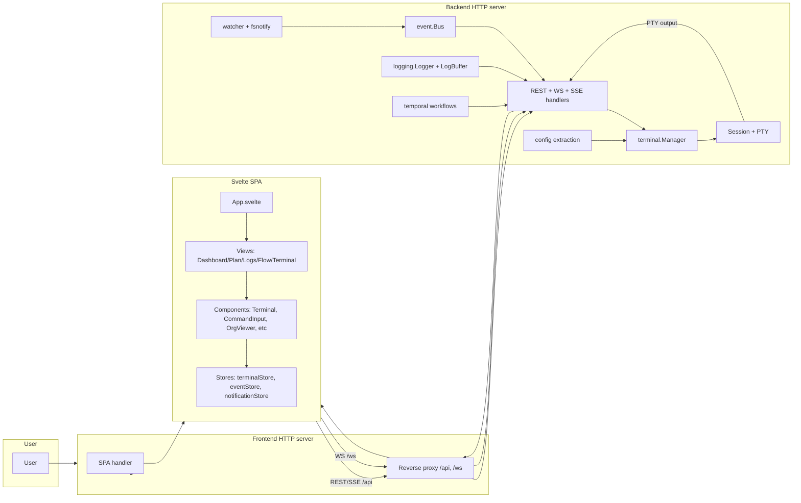

# Gestalt Architecture Review (Baseline)
Date: 2026-01-23
Scope: Document current architecture and data flow. No refactors proposed here.

## System overview
Gestalt is a local-first multi-session dashboard. A Go backend manages PTY
sessions, agent profiles, skills, workflows, logs, and filesystem watching.
A Svelte SPA is served by the backend and communicates over REST + WebSocket + SSE.
A separate CLI (gestalt-send) posts stdin to agent sessions.

Runtime topology (default):
- Backend HTTP server: serves REST + WS + SSE on the backend port.
- Frontend HTTP server: serves SPA assets and reverse proxies /api and /ws to
  the backend port.
- Optional Temporal dev server and workers when enabled.

HTTP response headers:
- API + WS + SSE responses set Cache-Control: no-store, must-revalidate and
  X-Content-Type-Options: nosniff.
- SPA HTML uses Cache-Control: no-cache; hashed static assets use
  Cache-Control: public, max-age=31536000, immutable; non-hashed assets use
  Cache-Control: no-cache.

## High-level data flow
1) User input in the SPA -> terminalStore -> /ws/session/:id -> PTY session.
2) PTY output -> Session output bus -> /ws/session/:id -> xterm in SPA.
3) Filesystem or git changes -> watcher -> event.Bus[watcher.Event] -> /api/events/stream
   (SSE) -> eventStore -> UI updates.
4) Logs -> logging.LogBuffer -> /api/logs/stream (SSE) and /ws/logs -> LogsView.
5) Workflows -> internal/temporal -> workflow events -> /api/events/stream (SSE).

## Component map (backend)
Entry points:
- cmd/gestalt: main server + config extraction + Temporal + HTTP servers.
- cmd/gestalt-send: CLI client for sending stdin to agent sessions.

Internal packages (Go):
- internal/terminal: PTY sessions, session lifecycle, buffers, logging, manager.
- internal/api: REST + WS + SSE handlers, SPA handlers, middleware.
- internal/agent: agent profile parsing, validation, caching.
- internal/skill: skill loader + prompt generation.
- internal/logging: log buffer + structured logger.
- internal/watcher: fsnotify wrapper + git branch monitoring + event publishing.
- internal/event: typed bus used by watcher, terminal, workflow, and logs.
- internal/config: embedded config extraction + version tracking.
- internal/plan: scanner + model conversion for `.gestalt/plans/*.org` documents.
- internal/prompt: prompt parsing, include resolution, render logic.
- internal/temporal: workflow orchestration, memo helpers, worker wiring.
- internal/metrics: metrics counters exposed via /api/metrics/summary.
- internal/version: build version string for /api/status and logs.

Backend runtime wiring (main.go):
- Loads config from flags/env/defaults; extracts embedded config to .gestalt/config
  unless dev mode is enabled.
- Loads agent + skill definitions and initializes terminal.Manager.
- Initializes event buses (agent, terminal, workflow, watcher) and log buffer.
- Starts optional Temporal client + worker.
- Starts filesystem watcher + plan watcher.
- Starts backend HTTP server and frontend HTTP server with reverse proxy to backend.

### Backend REST + WS surface
REST endpoints (grouped):
- Status/metrics/workflows: `/api/status`, `/api/metrics/summary`, `/api/workflows`
- Sessions: `/api/sessions`, `/api/sessions/:id`, `/api/sessions/:id/output`,
  `/api/sessions/:id/history`, `/api/sessions/:id/input-history`,
  `/api/sessions/:id/bell`, `/api/sessions/:id/notify`,
  `/api/sessions/:id/workflow/resume`, `/api/sessions/:id/workflow/history`
- Agents/skills/plans: `/api/agents`, `/api/agents/:name/input`,
  `/api/agents/:name/send-input`, `/api/skills`, `/api/plans`
- Flow/OTel: `/api/flow/activities`, `/api/flow/config`,
  `/api/otel/logs`, `/api/otel/traces`, `/api/otel/metrics`

SSE endpoints:
- `/api/events/stream` (filesystem/config/workflow/session/agent events)
- `/api/logs/stream` (log stream + replay)
- `/api/notifications/stream`

WebSocket endpoints:
- `/ws/session/:id` (PTY stream)
- `/ws/logs`, `/ws/events`
- `/api/agents/events`, `/api/sessions/events`,
  `/api/workflows/events`, `/api/config/events`

## Component map (frontend)
Entry: frontend/src/App.svelte
- TabBar-driven navigation between Dashboard, Plan, Status, and session tabs.

Views (5):
- Dashboard, PlanView, LogsView, FlowView (workflow status), TerminalView.

Components (11):
- Terminal, CommandInput, OrgViewer, OrgNode, TabBar, Toast, ToastContainer,
  NotificationSettings, WorkflowCard, WorkflowDetail, WorkflowHistory.

Stores / lib modules (14):
- terminalStore (xterm + session WS), eventStore (fs events SSE),
  terminalEventStore / agentEventStore / configEventStore / workflowEventStore,
  api (fetch wrapper + URL helper), notificationStore, orgParser, timeUtils,
  terminalTabs, version.

State management:
- Backend: terminal.Manager holds session state; buses emit typed events.
- Frontend: Svelte stores per domain (sessions, events, notifications).
  App.svelte owns top-level view state and re-syncs via /api/status + /api/sessions.

## Embedded assets and configuration flow
Embedded assets (embed.FS):
- frontend/dist (SPA build)
- config (default agents, prompts, skills)

Config extraction flow:
- On startup, embedded config is extracted to .gestalt/config based on
  manifest hash checks. Version compatibility is checked via .gestalt/version.json.
- Dev mode skips extraction and reads directly from config/ or GESTALT_CONFIG_DIR.

Frontend serving flow:
- Frontend server reverse proxies /api and /ws to the backend server.
- SPA assets served from frontend/dist (embedded) or static dir override if present.

## Architectural patterns in use
- Manager pattern: terminal.Manager centralizes session lifecycle and agent routing.
- Event bus pattern: internal/event.Bus[T] for fan-out, filtering, replay.
- Broadcaster pattern: terminal session output fan-out to multiple subscribers.
- Circular buffer pattern: terminal output/input buffers and log buffer.
- Embedded resources with overrides: embed.FS + extraction to .gestalt/config.
- Reverse proxy split: frontend server proxies API/WS to backend server.

## Implicit coupling and hidden dependencies
- Session identity: Manager derives session ids from agent names with per-run
  counters; UI relies on session ids for tab labels and deduping.
- Plan path: plans are loaded from `.gestalt/plans/*.org` via
  `plan.DefaultPlansDir()`, and the watcher monitors that directory.
- Config placement: default config dir is .gestalt/config; several features
  rely on relative paths (prompts, agents, skills).
- Event schemas: frontend stores assume specific JSON shapes for session events
  and depend on event_type values from backend.
- Temporal wiring: workflow UI assumes Temporal events are enabled and uses
  /api/workflows and /api/sessions/:id/workflow/history endpoints.
- Logging: LogsView depends on streaming from `/api/logs/stream` and `/ws/logs`,
  both backed by in-memory log retention.
- Reverse proxy: SPA expects /api and /ws on the frontend port; backend-only
  mode changes client URL assumptions.

## Metrics snapshot (lines of code)
Method: wc -l over source files; includes tests. Cyclomatic complexity tools
not available (gocyclo not installed).

Backend Go packages (files, lines):
- internal/api: 28 files, 8323 lines
- internal/terminal: 25 files, 4756 lines
- internal/agent: 28 files, 3247 lines
- internal/event: 7 files, 1502 lines
- internal/temporal: 8 files, 1318 lines
- internal/watcher: 7 files, 1312 lines
- internal/config: 10 files, 961 lines
- internal/skill: 7 files, 867 lines
- internal/prompt: 3 files, 959 lines
- internal/logging: 6 files, 443 lines
- internal/plan: 4 files, 309 lines
- internal/metrics: 1 file, 360 lines
- internal/version: 2 files, 81 lines

Commands:
- cmd/gestalt: 16 files, 4126 lines
- cmd/gestalt-send: 4 files, 1315 lines

Frontend (Svelte/JS):
- frontend/src: 32 files, 6541 lines
- frontend/src/views: 5 files, 1755 lines
- frontend/src/components: 11 files, 2534 lines
- frontend/src/lib: 14 files, 1995 lines

## Architecture diagram (Mermaid)

## Notes and follow-ups
- This document starts with a baseline and accumulates package-level analyses.
- Proposals below are for future L1 follow-up work; no refactors here.

## Package analysis: internal/terminal
Scope: Session lifecycle, PTY I/O, buffers, logging, and session manager.

### Responsibilities and data flow
- Session lifecycle: create, run, close; tracks metadata + workflow identifiers.
- PTY I/O: readLoop -> output channel; writeLoop <- input channel.
- Output fan-out: broadcastLoop writes to SessionLogger, OutputBuffer, and output bus.
- Input history: InputBuffer (memory) + InputLogger (JSONL file).
- Persistence: SessionLogger (text log) + history merging for API responses.
- Cleanup: session log retention logic in Manager.startSessionCleanup.
- Workflow integration: session.StartWorkflow and workflow signals from Session.
- Prompt/skill injection: Manager creates background goroutine to send prompts.

### Key types and modules
- Session: holds PTY process handles, output bus, buffers, input loggers, and
  workflow identifiers; manages three goroutines (read/write/broadcast).
- Manager: owns session registry, agent registry/cache, skills, event buses,
  prompt parsing, and workflow lifecycle wiring.
- OutputBuffer/InputBuffer: bounded in-memory buffers for output lines and
  input history entries.
- SessionLogger/InputLogger: async file writers with buffering and drop tracking.
- Pty + PtyFactory: abstraction over platform-specific PTY implementation.

### Complexity observations
- Session has many fields spanning metadata, I/O, logging, and workflow state.
  This makes it harder to reason about concurrency and responsibilities.
- Manager mixes concerns: agent registry/cache, session creation, prompt/skill
  injection, workflow start, log retention, and event emission.
- Prompt injection is a large inline goroutine inside createSession, which
  complicates testing and makes the flow harder to follow.
- Three goroutines per session are likely justified to prevent blocking PTY
  reads, but output channel backpressure can still stall reads if downstream
  is slow (output channel depth is 64).
- SessionLogger and InputLogger are almost identical in structure, with
  duplicated buffering, flush, drop, and close logic.
- OutputBuffer and InputBuffer are different but both implement bounded history;
  there is partial duplication in retention logic.
- Windows PTY support is a stub; behavior is explicit but not user-visible
  beyond error propagation from startPty.

### Improvement proposals (concrete)
Quick wins (<1 day):
- Extract prompt injection into a helper method or small type (PromptInjector)
  so createSession is shorter and prompt injection is testable in isolation.
- Add a small "session lifecycle" helper for logging and event emission
  (created/closed/error) to reduce repetition in Manager.
- Add explicit error message when startPty returns errConPTYUnavailable so
  Windows users get a clear, actionable response.

Medium refactors (1-3 days):
- Split Session into focused sub-structs (SessionMeta, SessionIO,
  SessionWorkflow) with clear ownership. Keep a small Session wrapper that
  composes them to reduce field sprawl and isolate concurrency-sensitive state.
- Extract an AsyncFileLogger utility (shared by SessionLogger and InputLogger)
  that handles buffering, flushing, and drop metrics with a small adapter for
  payload formatting.
- Pull agent/skill prompt injection into a Manager subcomponent or file
  (manager_prompt.go) to reduce manager.go size and isolate prompt flow.

Large refactors (1+ week, if justified):
- Introduce a SessionFactory that encapsulates shell generation, PTY startup,
  loggers, and initial Session wiring. This would keep Manager focused on
  registry + lifecycle, and simplify tests with fewer mocks.
- Replace the output channel + broadcastLoop with a dedicated output publisher
  that can apply backpressure policies (drop, sample, or buffer growth) to
  avoid PTY read stalls under slow subscribers.

### Risks and hidden coupling
- Session ids are derived from agent names with per-run counters, and the
  frontend uses session ids as tab labels. Any rename semantics need
  coordination with the UI.
- Prompt injection assumes session output contains the on-air marker and
  uses timed sleeps; this couples timing assumptions to CLI startup behavior.
- Output history merges file + buffer based on overlap matching, which can
  be brittle if logs contain repeated lines or truncation.

### Coverage notes (existing tests)
- High coverage in manager/session tests, but specific paths are likely untested:
  DSR handling (containsDSR/containsDSRResponse), workflow signal errors,
  output channel backpressure, and session log cleanup error paths.
- Prompt injection flow relies on timing; tests might be sensitive to real
  sleep delays (would benefit from clock injection in the injector).

## Package analysis: internal/api
Scope: REST endpoints, WebSocket + SSE handlers, middleware, SPA routing.

### Responsibilities and data flow
- Route registration in routes.go wires REST + WS + SSE handlers and SPA fallback.
- RestHandler in rest.go implements the majority of HTTP endpoints
  (status, metrics, agents, sessions, skills, logs, plan, workflows).
- WebSocket handlers are split per stream (session, plus legacy logs/events
  and agent/session/workflow/config event handlers).
- middleware.go provides auth + JSON error handling + request logging.
- spa.go serves the SPA with fallback to index.html for client-side routes.

### Key patterns
- Single RestHandler struct carries dependencies (Manager, Logger, PlanCache,
  Git info, Temporal UI port).
- REST endpoints use apiError to unify JSON error responses.
- WebSocket handlers manually validate auth and perform similar upgrade loops:
  authenticate -> upgrade -> subscribe -> goroutine for write -> read loop.
- Explicit gorilla/websocket usage for server-side upgrades and binary/text frames.

### Complexity observations
- rest.go is large and mixes routing logic, validation, business logic,
  response shaping, and helper utilities (git parsing, JSON writers).
- REST handler concerns span multiple domains; a single file makes it harder
  to isolate endpoint-specific changes and tests.
- WebSocket handlers repeat similar upgrade/write/read patterns with only small
  differences in event payloads.
- Auth checks are duplicated in WS handlers (not centralized via middleware).
- Git origin/branch parsing lives in rest.go but is also related to watcher
  and status logic, suggesting a small internal/git helper could reduce coupling.

### Improvement proposals (concrete)
Quick wins (<1 day):
- Extract small helpers for WS upgrade + write loop (shared in terminal and
  legacy event handlers) to reduce duplicated boilerplate.
- Add a wsAuth helper to consolidate token checks and respond consistently
  for WS endpoints.
- Move JSON encode/decode helpers (writeJSON, decodeJSON) to a small file to
  simplify rest.go readability.

Medium refactors (1-3 days):
- Split rest.go into domain-focused files: sessions.go, agents.go, skills.go,
  logs.go, status.go, workflows.go, plan.go. Keep RestHandler shared.
- Extract path parsing/validation for session routes (output/history/input)
  into small helpers with tests for edge cases.
- Introduce a consistent error wrapper for WS handlers (close codes + logging)
  to align with REST error handling.

Large refactors (1+ week, if justified):
- Introduce a small router layer per domain (e.g., TerminalAPI) to shrink the
  monolithic RestHandler while keeping shared deps explicit.
- Consider a shared WS stream abstraction (subscribe + marshal + send) to
  unify agent/session/workflow/config event handlers.

### Risks and hidden coupling
- Frontend expects specific error message shapes from REST (error + optional
  session_id) and uses status codes for duplicate-agent handling.
- Event stream message shapes are relied upon by frontend stores and tests;
  any refactor must preserve payload fields and timing assumptions.

## Package analysis: internal/watcher
Scope: fsnotify wrapper, debounce + restart logic, git branch monitoring.

### Responsibilities and data flow
- Watcher.New initializes fsnotify watcher and internal event channels.
- Watch registers callbacks per path; can optionally fan out directory events.
- debounce map coalesces rapid changes into a single Event after a delay.
- restart logic handles fsnotify errors with backoff and limited retries.
- cleanup loop removes unused watches and enforces max watch count.
- GitWatcher watches .git/HEAD and publishes branch change events to event bus.
- bus.go bridges Watcher events into event.Bus[watcher.Event].

### Complexity observations
- watcher.go combines callback registry, debounce scheduling, fsnotify plumbing,
  restart/backoff, and cleanup in one file (~550 LOC), making it dense.
- debounce and recursive directory handling are intertwined; path-based lookup
  doubles as both event routing and debounce keying.
- Git branch parsing is duplicated here and in internal/api (status endpoint).
- WatchDirRecursive behavior depends on fsnotify semantics; it only expands
  callbacks, not actual watch registrations for nested directories.

### Improvement proposals (concrete)
Quick wins (<1 day):
- Split watcher.go into smaller files: watch_registry.go, debounce.go,
  restart.go, cleanup.go to reduce cognitive load.
- Extract git parsing helpers into internal/git (or reuse from one place) to
  remove duplicate resolveGitDir/readGitBranch implementations.
- Add doc comment clarifying WatchDirRecursive behavior (fan-out only) so
  callers know it does not add recursive watches.

Medium refactors (1-3 days):
- Introduce a debounce helper that tracks per-path timers to isolate timing
  logic and simplify handleEvent/flush.
- Separate watch registration from callback fan-out, so a directory watch can
  be treated explicitly (and potentially support recursive watch expansion).
- Expand watcher Metrics to include dropped events and restart attempts for
  better observability.

Large refactors (1+ week, if justified):
- Add optional recursive directory watching by enumerating subdirectories and
  maintaining a watch tree (careful with max watches).
- Consider a Watcher interface that accepts a context for cancellation to
  unify shutdown and reduce background goroutine coordination.

### Risks and hidden coupling
- Max watch limit is enforced at registration time; higher-level features
  relying on multiple watches (plan + git) can silently fail if the limit is
  reached.
- Restart logic is best-effort; repeated fsnotify failures trigger error
  handler, which upstream uses for user-visible warnings.

## Package analysis: internal/agent
Scope: agent profile parsing, validation, caching, and shell generation.

### Responsibilities and data flow
- Loader scans config/agents/*.toml, validates, and de-duplicates IDs/names.
- PromptList supports TOML prompt values as string or array.
- Validation applies JSON-schema checks for cli_config based on cli_type.
- BuildShellCommand generates CLI commands for codex/copilot from cli_config.
- AgentCache reloads agents from disk and compares ConfigHash for changes.
- Config validation errors are published on the config event bus.

### Complexity observations
- Agent.Validate mutates Shell when cli_config is present; validation doubles
  as normalization (hidden coupling for callers).
- Prompt existence checking is implemented locally; prompt parsing lives in
  internal/prompt, but the loader only validates file presence.
- Loader enforces unique agent Name with a simple map (case-sensitive).
- normalizeAgentPaths adds complexity to support embed.FS + real FS layout.

### Improvement proposals (concrete)
Quick wins (<1 day):
- Document that Agent.Validate may overwrite Shell when cli_config is set.
- Centralize prompt existence checks by reusing internal/prompt resolver to
  reduce duplication and ensure consistent resolution rules.
- Consider normalizing agent name uniqueness with case folding to prevent
  subtle duplicates (if desired by product UX).

Medium refactors (1-3 days):
- Extract a shared loader helper for agent/skill scanning (directory walk,
  duplicate handling, warnings) to reduce duplication across packages.
- Separate validation from normalization: return a derived Shell rather than
  mutating Agent in Validate, or document mutation explicitly in loader logic.

Large refactors (1+ week, if justified):
- Introduce a dedicated AgentRegistry to own cache + reload behavior and emit
  events, keeping Manager focused on session lifecycle.

### Risks and hidden coupling
- Agent name uniqueness is enforced at load time; session ids derived from
  agent names are reused by session tabs, so normalization impacts the UI and
  agent resolution in CLI.

## Package analysis: internal/skill
Scope: skill parsing (frontmatter + body), validation, loader, prompt XML.

### Responsibilities and data flow
- Loader scans skills directory for SKILL.md in subdirectories.
- Parse splits YAML frontmatter from markdown body and populates Skill.
- Validate checks naming rules and optional scripts/references/assets folders.
- GeneratePromptXML emits lightweight XML metadata for LLM context.

### Complexity observations
- Loader + Parse are straightforward, with most complexity in frontmatter split
  and filesystem abstraction (fs.FS vs OS paths).
- cleanFSPath is duplicated across agent/skill loaders.
- XML escaping is hand-rolled and only handles a subset of XML-unsafe chars.

### Improvement proposals (concrete)
Quick wins (<1 day):
- Use encoding/xml.EscapeText for XML escaping to avoid edge cases with quotes
  or other XML entities.
- Deduplicate cleanFSPath between agent/skill loaders in a small helper package.

Medium refactors (1-3 days):
- Extract a shared "config loader" helper for skill/agent directory scanning
  (path normalization, duplicate detection, warning hooks).
- Consider centralizing SKILL.md parsing rules if other features consume it.

Large refactors (1+ week, if justified):
- Expand skill prompt generation to include structured metadata fields if/when
  the frontend or agents need richer skill discovery.

### Risks and hidden coupling
- Skill directory name must match frontmatter name; renames require coordinated
  changes in the filesystem and in frontmatter.

## Package analysis: internal/logging
Scope: structured logging, log buffer, log event bus.

### Responsibilities and data flow
- Logger emits LogEntry to LogBuffer (ring buffer), event.Bus, and stdout.
- LogBuffer provides in-memory history for `/api/logs/stream` and `/ws/logs`.
- logging.Level and parsing helpers standardize severity handling.

### Complexity observations
- LogBuffer is a simple ring buffer; similar retention logic exists in
  terminal OutputBuffer/InputBuffer and could be shared.
- Logger publishes to event.Bus with BlockOnFull; slow subscribers can
  introduce backpressure if logging is frequent.
- Context fields are map[string]string, which keeps payloads simple but
  limits structured data types.

### Improvement proposals (concrete)
Quick wins (<1 day):
- Consider making defaultLogSubscriberBuffer configurable to avoid log drops
  or stalls under high throughput.
- Align ring buffer behavior with terminal buffers via a shared buffer helper
  to reduce duplication.

Medium refactors (1-3 days):
- Add optional output formatting hooks (JSON vs text) to avoid custom
  formatting in multiple places.
- Consider a typed context map (map[string]any) if structured log payloads
  are needed for metrics or OTEL logs.

Large refactors (1+ week, if justified):
- Migrate LogBuffer to a generic ring buffer package shared with terminal
  buffers and input history to standardize retention/overflow behavior.

### Risks and hidden coupling
- `/api/logs/stream` and `/ws/logs` assume LogBuffer retention in-memory;
  reducing size or changing ordering affects frontend log views.

## Package analysis: internal/orchestrator
Scope: placeholder removed to avoid misleading APIs.

### Current state
- The package was removed; no orchestration API is defined.
- Future orchestration should be introduced with a concrete interface and
  implementation when requirements are clear.

## Package analysis: internal/version
Scope: build-time version metadata.

### Current state
- Package exposes version fields (Version, Major, Minor, Patch, Built, GitCommit)
  intended for ldflags injection.
- GetVersionInfo returns parsed integers for API responses.

### Improvement proposals (concrete)
Quick wins (<1 day):
- Keep as-is; small package is a clean separation from cmd/gestalt.

### Risks and hidden coupling
- Version parsing defaults to 0 on invalid values; if ldflags are malformed,
  the API may report misleading version numbers.

## Package analysis: cmd/gestalt
Scope: main entrypoint, config loading, server lifecycle, subcommands.

### Responsibilities and data flow
- Parses CLI flags/env defaults and builds Config.
- Extracts embedded config to .gestalt/config unless dev mode is enabled.
- Initializes logger, event bus, agent + skill loaders, terminal.Manager.
- Starts Temporal dev server + client/worker when enabled.
- Starts filesystem watch (plan + git) and event streams.
- Launches backend HTTP server and frontend proxy server.
- Provides subcommands: completion, validate-skill, config validate, index,
  and legacy no-op extract-config.

### Complexity observations
- main.go is large and mixes config parsing, runtime wiring, and server
  lifecycle, making it difficult to test smaller units.
- Several helper functions (prompt validation, plan watcher) live in main.go or
  adjacent files; ownership boundaries are fuzzy.
- Command-specific logic (validate config, index) lives in cmd/gestalt but
  shares data structures with runtime code, which complicates reuse.

### Improvement proposals (concrete)
Quick wins (<1 day):
- Extract server startup/shutdown into a small type (ServerRunner) to isolate
  HTTP lifecycle logic from config parsing.
- Move prompt validation into internal/prompt or internal/config helpers for
  reuse by other commands.

Medium refactors (1-3 days):
- Split main.go into multiple files: config_load.go, server.go, temporal.go,
  watchers.go, to improve readability and test isolation.
- Introduce an internal/config or internal/app package that builds the runtime
  dependencies (logger, manager, event buses) so main.go becomes orchestration.

Large refactors (1+ week, if justified):
- Create a command struct pattern (e.g., runServer, runValidate, runIndex) with
  shared dependency injection, enabling simpler unit tests and CLI reuse.

### Risks and hidden coupling
- Frontend server reverse proxy assumes /api and /ws routes are on localhost;
  any change to backend address formation impacts frontend connectivity.

## Package analysis: cmd/gestalt-send
Scope: CLI tool for sending stdin to agent sessions.

### Responsibilities and data flow
- Parses CLI flags/env defaults and resolves agent by name or id.
- Fetches /api/agents to resolve IDs and caches results to disk.
- Sends stdin payload to /api/agents/:name/input, optionally starting agent.
- Provides bash/zsh completions and internal __complete-agents helper.

### Complexity observations
- main.go contains parsing, HTTP client, cache, completion scripts, and command
  execution; a single file makes it harder to test small pieces.
- Agent resolution logic handles ambiguous matches but shares error handling
  with HTTP transport; code paths are intertwined.
- Cache file format is ad-hoc TSV with TTL; works but is not shared with other
  tooling or tests outside this file.

### Improvement proposals (concrete)
Quick wins (<1 day):
- Split main.go into parse.go, http.go, completion.go for readability.
- Centralize sendError handling so exit codes and messages are consistent.

Medium refactors (1-3 days):
- Extract HTTP client helpers (fetchAgents, sendAgentInput, startAgent) into a
  small internal/client package to enable reuse and easier unit tests.
- Formalize agent cache format (JSON with timestamp) to simplify parsing and
  future extension.

Large refactors (1+ week, if justified):
- Add a shared CLI framework for gestalt and gestalt-send to reduce duplicated
  flag/env parsing and help generation.

### Risks and hidden coupling
- Agent resolution relies on case-insensitive matching; any change to server
  agent naming or ID conventions affects CLI behavior and completions.

## Package analysis: frontend architecture
Scope: Svelte SPA structure, state flow, store usage, and component layering.

### Responsibilities and data flow
- App.svelte owns top-level UI state and tab routing (no external router).
- Views orchestrate API calls and domain UI (Dashboard, Plan, Logs, Flow, Terminal).
- Components encapsulate UI building blocks (Terminal, CommandInput, OrgViewer,
  Workflow cards, notifications).
- Stores provide shared state and stream subscriptions (terminalStore WS,
  eventStore SSE, agent/config/workflow event stores, notificationStore).

### Complexity observations
- App.svelte handles both app routing and data refresh, which centralizes
  control but keeps state local instead of in stores.
- Dashboard.svelte is heavy and mixes data fetching, caching, and UI logic.
- Multiple event stores follow similar patterns; potential duplication and
  inconsistent reconnection handling across stores.
- Terminal interactions are split between Terminal.svelte and terminalStore,
  which is necessary but makes tracing data flow harder.

### Improvement proposals (concrete)
Quick wins (<1 day):
- Document a front-end data flow guide (which store owns what) to reduce
  onboarding time.
- Add a thin routing helper to centralize active tab computation and reduce
  repeated tab list rebuilding.

Medium refactors (1-3 days):
- Move view-specific data fetching into stores or dedicated modules to
  simplify view components.
- Consolidate event store boilerplate into a generic sseStore helper to
  standardize reconnect and error handling.

Large refactors (1+ week, if justified):
- Introduce a small routing layer to formalize view transitions and allow
  bookmarking/deep-linking if needed.

### Risks and hidden coupling
- The UI assumes /api and /ws are proxied from the same origin; changing
  server topology requires coordinated frontend updates.

## Package analysis: frontend/src/lib
Scope: shared stores, API helpers, utilities.

### Responsibilities and data flow
- api.js handles fetch wrapper and WebSocket/EventSource URL construction with token.
- terminalStore manages xterm lifecycle, session WS, input handling, and
  touch scrolling behavior.
- eventStore + agent/config/session/workflow event stores subscribe to SSE
  event streams and fan out to listeners.
- notificationStore manages toast notifications.
- orgParser parses Org-mode snippets for PlanView.
- timeUtils provides relative time formatting.
- terminalTabs formats session labels used by App.svelte.

### Complexity observations
- terminalStore is large and handles multiple concerns (xterm setup, WS
  reconnect, input modes, clipboard, touch scrolling).
- Event stream modules rely on a shared SSE helper; session WS still uses
  separate lifecycle logic.
- api.js fetch wrapper is simple but duplicated error handling in some views.

### Improvement proposals (concrete)
Quick wins (<1 day):
- Split terminalStore into focused modules (xterm setup, WS connection,
  input handling) to improve readability and testability.
- Deduplicate event store SSE logic into a shared helper (sseStore factory).

Medium refactors (1-3 days):
- Create a shared stream client module used by terminalStore (WS) and SSE
  event stores to standardize reconnect/backoff behavior and logging.
- Introduce a small API client layer (agents, sessions, logs) to reduce
  repeated fetch + parse logic in views.

Large refactors (1+ week, if justified):
- Re-architect terminalStore into a service + store separation where the
  service manages xterm lifecycle and the store exposes state to components.

### Risks and hidden coupling
- terminalStore behavior is tightly coupled to Terminal.svelte layout and
  scroll handling; changes require coordinated UI adjustments.

## Package analysis: frontend components
Scope: Svelte UI components (Terminal, CommandInput, OrgViewer, etc.).

### Complexity observations
- Terminal.svelte coordinates xterm attachment, reconnect state, history
  fetching, and input handling; it is doing both UI and operational logic.
- CommandInput.svelte mixes UI, history fetch, and keyboard handling logic.
- OrgViewer/OrgNode use a recursive rendering pattern that is clear but
  can be sensitive to deep nesting performance.
- Workflow components (WorkflowCard/Detail/History) embed formatting logic
  that could be shared with FlowView.

### Improvement proposals (concrete)
Quick wins (<1 day):
- Extract history fetch and command submission into a small helper module to
  keep CommandInput focused on UI concerns.
- Split Terminal.svelte into TerminalShell (layout/header) and TerminalCanvas
  (xterm attachment) to reduce file size.

Medium refactors (1-3 days):
- Create shared formatting helpers for workflow timestamps and labels to
  reduce duplication across workflow components and FlowView.
- Add shallow component tests for Terminal and CommandInput for key behaviors
  (focus, submit, reconnect state).

Large refactors (1+ week, if justified):
- Move most non-UI logic to stores or services; keep components as thin
  presentation layers.

### Risks and hidden coupling
- Terminal and CommandInput assume specific API endpoints and response shapes
  for input history; changing API behavior requires coordinated frontend updates.

## Package analysis: frontend views
Scope: Dashboard, PlanView, LogsView, FlowView, TerminalView.

### Complexity observations
- Dashboard.svelte is the heaviest view: handles agents, skills, logs, git
  status, and event subscriptions in one place.
- PlanView includes fallback polling logic alongside event subscriptions,
  which duplicates some retry logic already present in eventStore.
- LogsView mixes log filtering, auto-refresh, and rendering logic.
- TerminalView is thin, acting as a wrapper around Terminal component.

### Improvement proposals (concrete)
Quick wins (<1 day):
- Extract API calls for agents/skills/logs into shared helpers or stores to
  reduce view size and repeated error handling.
- Consolidate polling fallback logic into a reusable hook/store.

Medium refactors (1-3 days):
- Move Dashboard data orchestration into a store to simplify the view.
- Standardize view-level loading/error UI patterns (shared components or mixins).

Large refactors (1+ week, if justified):
- Adopt a small state machine per view for async flows (loading, error,
  refreshing) to improve clarity and testability.

### Risks and hidden coupling
- Dashboard relies on session list shape from /api/sessions to infer agent
  running state; API changes must preserve these fields.

## Package analysis: Go dependencies
Scope: direct Go module dependencies and justification.

### Current direct dependencies (go.mod)
- github.com/creack/pty: PTY support for terminal sessions (no stdlib alternative).
- github.com/fsnotify/fsnotify: cross-platform filesystem watching.
- github.com/gorilla/websocket: WebSocket server support and origin checks.
- go.temporal.io/sdk + go.temporal.io/api: workflow engine for session workflows.
- gopkg.in/yaml.v3: YAML parsing for skills.
- github.com/mattn/go-sqlite3: SCIP index storage backend.
- github.com/klauspost/compress: compression utilities used by SCIP/tooling.
- google.golang.org/protobuf: protocol buffer types (Temporal/SCIP).
- golang.org/x/time: time utilities (Temporal client dependencies).

### Observations
- The original “4 dependency” baseline is outdated; the Temporal + SCIP features
  add several direct dependencies.
- gorilla/websocket remains the practical choice for server-side WS; stdlib has
  no WS server and x/net/websocket is effectively frozen.

### Improvement proposals (concrete)
Quick wins (<1 day):
- Document the direct dependency list in docs to avoid confusion about current
  dependency footprint.

Medium refactors (1-3 days):
- Evaluate whether SCiP dependencies can be optional (build tags) to reduce the
  default dependency surface for users who do not use SCIP features.

### Risks and hidden coupling
- Removing gorilla/websocket would require reworking WS handlers; compatibility
  risks are non-trivial.

## Package analysis: frontend dependencies
Scope: package.json dependencies and devDependencies.

### Current dependencies
- @xterm/xterm: terminal emulator core (required).
- @xterm/addon-fit: terminal sizing helper (small, maintained).

### Dev dependencies
- Svelte, Vite, Vitest, Testing Library, JSDOM, coverage plugin.

### Observations and proposals
- Dependency footprint is already minimal; no changes needed.
- Keep addon-fit unless a custom sizing implementation is preferred.

## Cross-cutting analysis: duplication and extraction
Scope: repeated patterns across backend and frontend.

### Notable duplication
Backend:
- Buffer logic: internal/logging.LogBuffer vs terminal OutputBuffer/InputBuffer.
- Async file writers: SessionLogger vs InputLogger (nearly identical).
- Git parsing: resolveGitDir/readGitBranch in internal/watcher and internal/api.
- Path normalization: cleanFSPath in agent loader and skill loader.
- WebSocket handler boilerplate: repeated upgrade/write loop in terminal and
  legacy event handlers.

Frontend:
- Event stream lifecycle code is split between terminal WS and SSE stores.
- Similar error handling patterns in views when calling apiFetch.

### Extraction opportunities (prioritized)
High value:
- Shared AsyncFileLogger for SessionLogger/InputLogger (reduce duplication,
  unify flush/drop behavior).
- Shared WS helper for backend handlers (upgrade + write loop + close handling).
- Shared SSE helper for frontend event stores (connect/reconnect/dispatch).

Medium value:
- Shared buffer/ring buffer helper for log and terminal buffers (if semantics align).
- Shared git parsing helper (internal/git) for watcher + status endpoints.
- Shared loader utilities for agent/skill path normalization and directory scanning.

Lower value:
- Shared API error parsing for frontend views (small duplication).

### Notes
- Apply the “rule of three” and favor extractions that reduce both code size
  and cognitive load, especially in hot paths (terminal/session, stream handling).

## Cross-cutting analysis: error handling consistency
Scope: backend error propagation/logging and frontend error reporting.

### Backend observations
- REST handlers use apiError with JSON responses; WS handlers use http.Error
  directly and do not emit structured error payloads.
- Error wrapping is mixed; some paths use fmt.Errorf with %w, others return
  raw errors without context.
- Terminal/session errors often log with contextual fields, but some error
  paths return generic messages to clients.

### Frontend observations
- apiFetch throws Error with status and optional data; views catch and
  sometimes show toasts, sometimes only set local error state.
- WebSocket errors are mostly logged to console; user-facing feedback is
  inconsistent across stores.

### Improvement proposals (concrete)
Quick wins (<1 day):
- Standardize REST error messages and ensure consistent error field names.
- Add a lightweight WS error envelope for close/error events and surface
  user-friendly messages where appropriate.

Medium refactors (1-3 days):
- Introduce error codes in API responses for programmatic handling in the UI.
- Centralize frontend error handling in a single store/helper to unify
  notifications and error UI.

### Risks and hidden coupling
- Changing error messages can affect tests and CLI behavior that relies on
  specific error strings (e.g., gestalt-send parsing).

## Cross-cutting analysis: testing strategy and coverage gaps
Scope: backend + frontend test coverage and gaps.

### Observations
- Backend tests are broad with unit + integration coverage across packages.
- Lower coverage areas (per plan notes): cmd/gestalt, cmd/gestalt-send,
  internal/api, internal/watcher.
- Frontend uses Vitest + Testing Library with component and store tests; coverage
  is not currently reported in the repo.

### Likely gaps
- Error paths in WebSocket handlers (close codes, write errors).
- Terminal session edge cases (DSR fallback, backpressure).
- Watcher restart/backoff edge cases and max watches exhaustion.
- CLI error handling and exit code mapping for gestalt-send.

### Improvement proposals (concrete)
Quick wins (<1 day):
- Add a coverage target script for frontend (already has test:coverage).
- Add tests for critical error paths (WS close, auth failures, watcher restart).

Medium refactors (1-3 days):
- Expand integration tests for api/ws endpoints with structured error payloads.
- Add table-driven tests for CLI parsing + error mapping.

### Risks and hidden coupling
- Integration tests may rely on timing (WS, watcher); keep timeouts explicit
  and use mocks where possible to avoid flakes.

## Prioritized improvement roadmap
This consolidates the analysis into actionable follow-up work items.

### Quick wins (high impact, low effort)
- Extract AsyncFileLogger shared by SessionLogger/InputLogger.
- Split terminalStore into smaller modules; document ownership boundaries.
- Add WS helper for backend handlers to reduce duplicated upgrade/write loops.
- Add wsStore helper for frontend event stores.

### Medium refactors (1-3 days)
- Split cmd/gestalt main.go into config/server/temporal/watchers files.
- Split RestHandler endpoints into domain-specific files.
- Move Dashboard data fetching into a store or helper module.
- Introduce internal/git helpers for shared git parsing.

### Large refactors (1+ week)
- Session/Manager refactor (SessionMeta/SessionIO/SessionWorkflow + SessionFactory).
- Frontend terminalStore + Terminal component separation into service + UI.
- Optional build tags for SCIP to reduce default dependency surface.

### Impact/Effort matrix (top candidates)
- High impact / Low effort: AsyncFileLogger, WS helper extraction, git parsing helper.
- High impact / Medium effort: Split RestHandler + terminalStore, Dashboard store.
- High impact / High effort: Session/Manager refactor, optional SCIP build tags.

### Proposed follow-up L1 work plans
- Terminal session refactor and logging consolidation.
- WebSocket and event stream consolidation (backend + frontend).
- Frontend state/store simplification (terminalStore and Dashboard).
